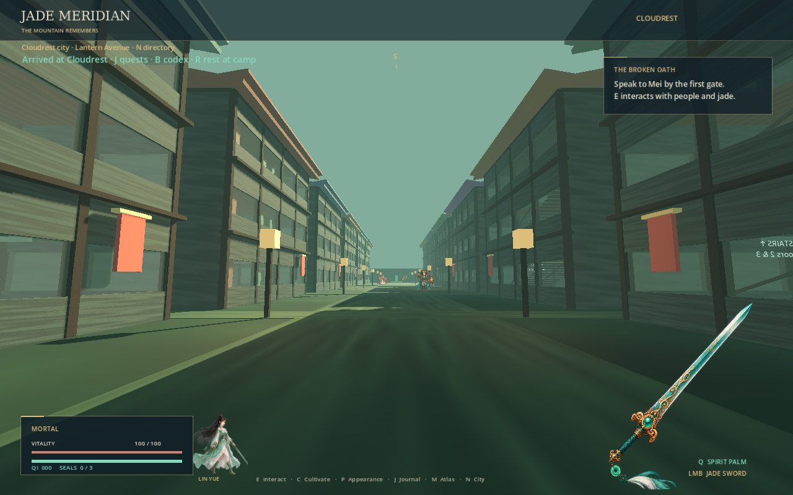
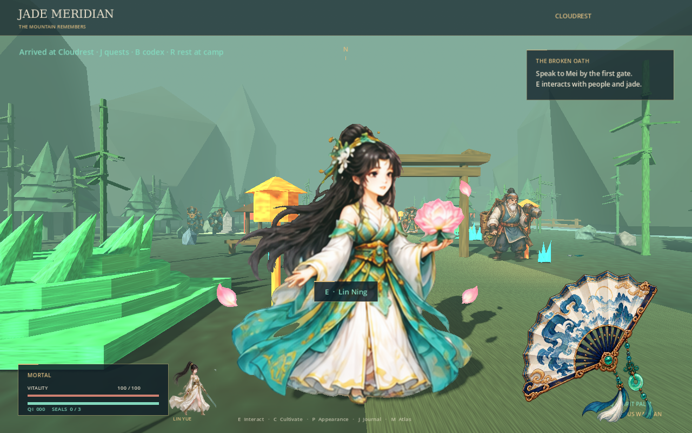
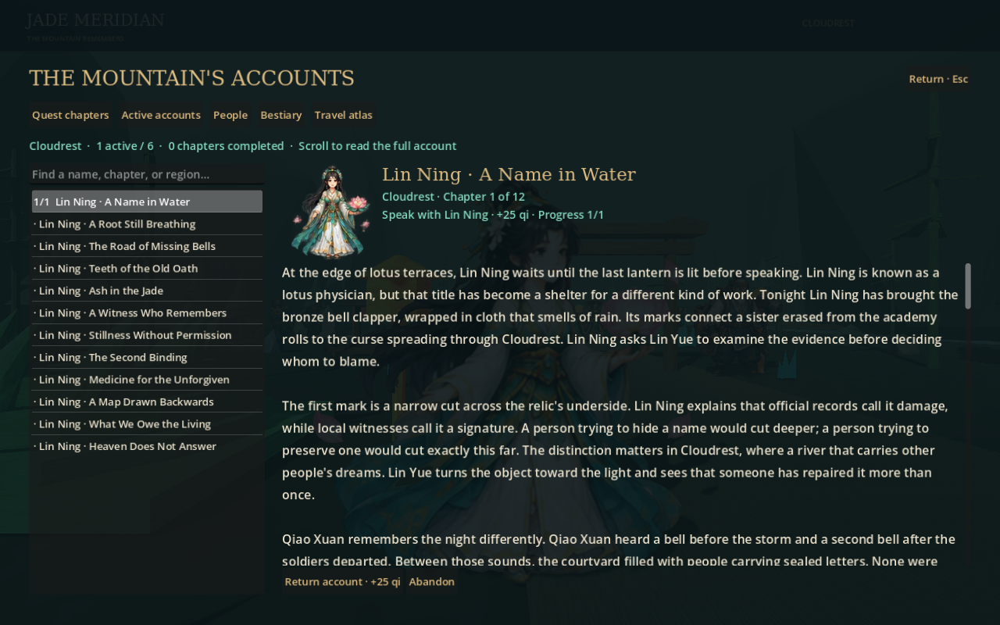
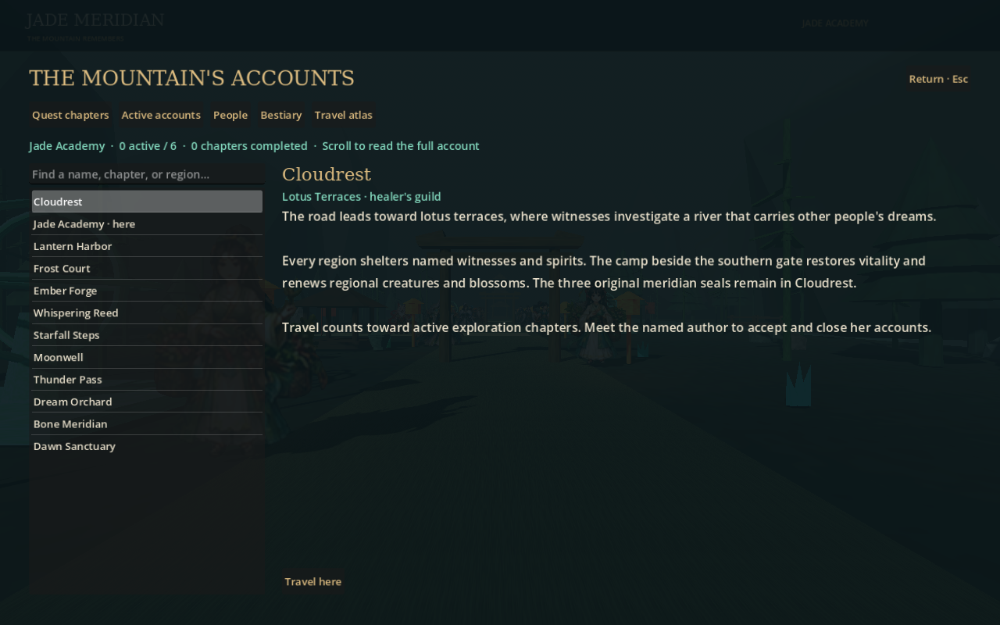
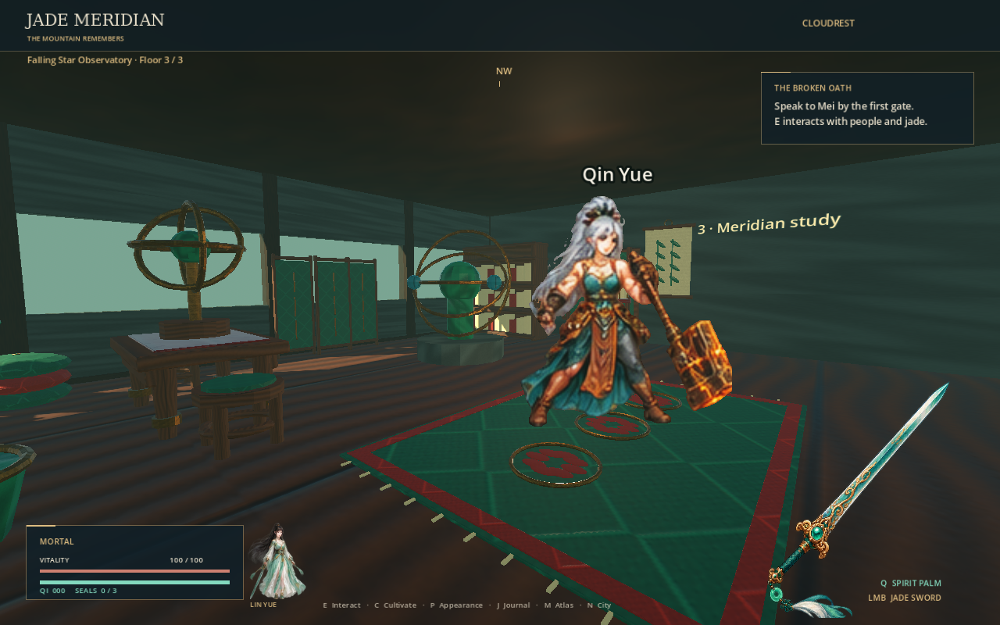
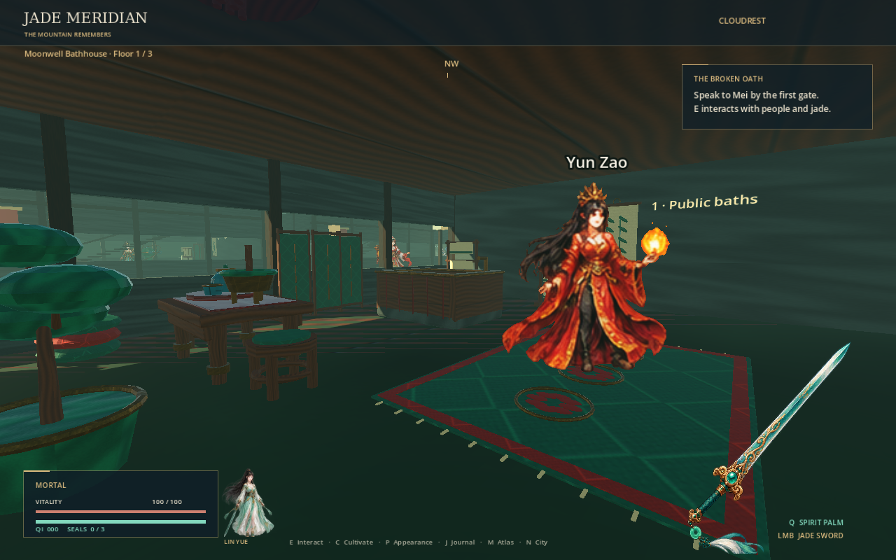
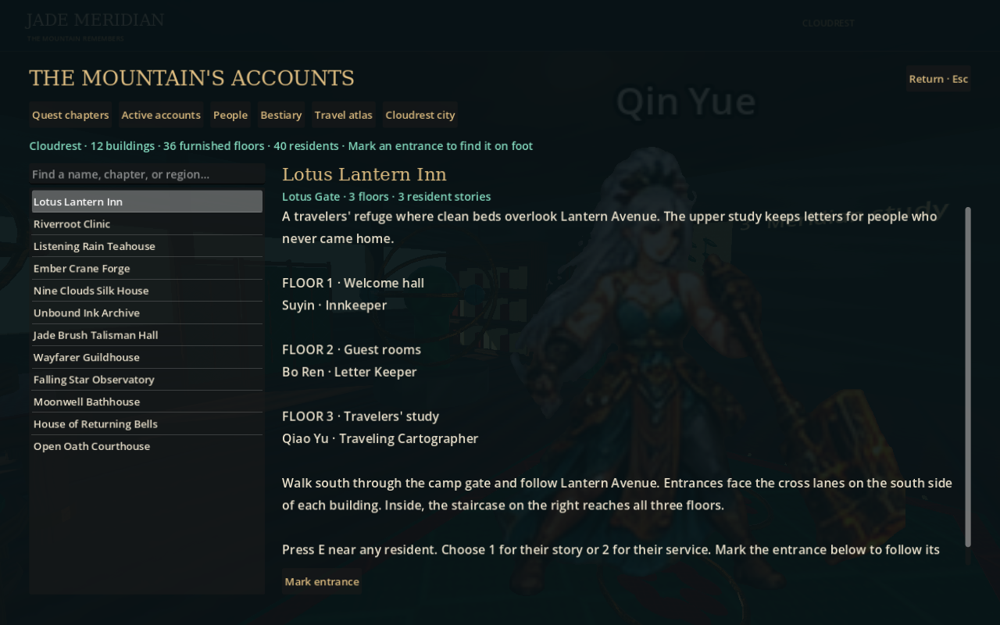

# Ashes of the Jade Meridian

A first-person 2.5D xianxia game in **Godot 4.7.2 stable**, with a female cultivator, animated 2D characters, textured 3D surroundings, cultivation, and a branching story. The expanded campaign has **100 NPCs, 100 monster species, 1,200 linked quest chapters, and 12 travel regions**.

Cloudrest now also has **12 enterable city buildings, three furnished floors per building, and 40 additional named residents**. The interiors contain **653 placements of 40 new textured Blender GLBs**. Walk south through the valley camp gate to explore Lantern Avenue. Press **N** for the searchable city directory and entrance markers.





Lin Yue returns to Cloudrest carrying her teacher's sword. Immortal Xu once saved the village, then bound his dead daughter's soul to its mountain. Mei reads the river's memory, Shen reveals the wardens, and Lan asks whether protection grants ownership. Restore three seals, reach Foundation, and choose Mercy or Ascension. Beyond that central story, a hundred witnesses investigate the empire's bindings: sold futures, inherited debts, confiscated dreams, and silence bought with medicine.

## Play

```bash
python3 tools/install_toolchain.py --destination "$PWD/.tools"
export PATH="$PWD/.tools:$PATH"
godot --editor --path . --import --quit
godot --path .
```

CI verified checksum-checked **Godot 4.7.2** and **Blender 5.2.2 LTS** on 2026-10-02. The installer resolves the latest stable Blender release. Open `project.godot` and run with F5 in the editor. Interactive play needs a display; automated checks also run headlessly.

| Control | Action |
| --- | --- |
| Enter / left click on title | Begin |
| WASD / mouse | Move / look |
| Shift / Space | Sprint / jump |
| E | Interact with a nearby visible person, blossom, or seal |
| Left click / Q | Weapon attack / spirit palm |
| C, then Enter | Attempt cultivation breakthrough |
| H | Use one moonlotus to heal |
| J | Search and read quest chapters; view active tasks |
| B | NPC lore and monster bestiary |
| M | Travel atlas for all twelve regions |
| N | Search city buildings, floors, and residents; mark an entrance |
| 1 / 2 in city dialogue | Hear a resident's story / use their service |
| R near the southern gate | Rest, restore vitality, renew regional resources and monsters |
| P, then 1 / 2 / 3 | Customize hair / clothing / weapon; mouse also works |
| F2 | View all twelve sides of the nearby character or Lin Yue; arrows step, Space rotates |
| Escape | Pause / close panel |
| F5 / F9 | Save / load |
| L on title | Continue a saved journey |
| F7 / V | Toggle music / voices |
| 1 / 2 at Xu's final choice | Mercy / Ascension |

Breakthroughs cost **30 / 75 / 140 qi**. Qi Awakening unlocks spirit palm; Foundation plus three restored seals breaks Xu's protection. Bring Mei three moonlotus to start the central story. Renewable camp blossoms keep healing and gathering quests recoverable.

## Campaign and customization



Each named NPC owns a twelve-chapter arc. Speak beside the author to accept a chapter, carry out its objective, and return for qi and reputation. Up to six chapters may be active. Objectives require actual conversations, gathering, regional travel, rest, or victories over a named monster. Later chapters require their predecessors; rewards are awarded once. The final chapter offers release or inheritance of its binding. The scrollable journal makes every chapter readable, including earlier completed accounts.

The checked corpus contains **2,200,589 words** of quest prose, consequences, and NPC/monster lore. It is **procedurally composed from authored scene templates and linked histories**, with recurring passages and quest patterns. It is not a claim of a million individually written words or a million different narrative events. Counts exclude IDs, metadata, source code, titles, and unused alternate outcomes. Each monster also has a separately authored history, and lore uniqueness is checked after removing the character's name.

Lin Yue defaults to jade robes, loose black hair, and a jade sword. Four hairstyles and four outfits make sixteen independent combinations. Four weapons change reach, cooldown, damage, or spirit-palm strength. New four-pose heroine artwork animates her portrait and preview; her generated weapon appears in first-person view. All selections persist with progression.


The **F2 character turntable** displays twelve generated viewing angles together or rotates through them in 30° steps. Its roster lists registered character artwork and labels Lin Yue's hair and clothing combinations. In the world, registered NPCs and monsters select side and rear drawings from the camera's position; their original frontal and combat animations remain available. These are directional idle drawings, with the same pose used while walking, rather than new twelve-direction animation cycles. `assets/sprites/directional/catalog.json` inventories the full requested roster; `manifest.json` records only finished twelve-view sets and their unchanged generated source PNGs.


Regions share the modular valley layout, with different inhabitants, lighting palettes, and three region-specific Blender landmarks. Travel loads the regional cast; camp rest renews its creatures and blossoms. The original Cloudrest seals, guardians, and Xu retain permanent progression. This is a campaign prototype with a large procedural narrative corpus, rather than twelve independently handcrafted terrain maps.

## Cloudrest city

The city contains an inn, clinic, teahouse, forge, tailor, archive, talisman hall, guildhouse, observatory, bathhouse, bell house, and courthouse. All twelve buildings have open ground-floor entrances and two physical staircases connecting three floors. Each floor has at least **16 textured GLB props**: carved furniture, brocade beds, medicine drawers, a working-room loom, weapon racks, scrolls, bath basins, instruments, bells, and offerings. Rugs, hanging lanterns, bamboo scrolls, cushions, and bonsai finish the rooms. A resident lives on every floor, with four more people along the avenue.

The new models were generated with **headless Blender 4.3.2** in the current environment. Twelve material families use **36 original 256×256 albedo, roughness, and normal maps**, embedded in the GLBs; floors and plaster also use those detailed surfaces. Shared scene resources and meshes joined by material limit duplicate assets and draw calls. Furniture collisions leave the entrance, residents, and staircase routes accessible.

Press E near any city resident, then 1 for their authored personal story or 2 for advice or a service. Services include healing, rest, tea, tailoring, cultivation, chapter reading, and travel planning. City hospitality restores resources without granting repeatable qi; camp-rest chapters still require the valley camp. The 40 city residents reuse 40 distinct existing high-resolution character designs. Their local dialogue is separate from the existing 100 campaign authors and their chapter chains.





See [the city layout and verification](docs/CITY.md) for all addresses and floor names.

## Assets and evidence

| Library | Included | Source |
| --- | ---: | --- |
| Textured world and landmark models | **1,061 distinct GLBs + 1,061 texture PNGs** | Headless Blender: original 1,024 variants, 36 regional landmarks, and one camp beacon |
| Textured city interiors | **40 additional GLBs + 36 PBR texture PNGs** | Headless Blender: 653 placements across 36 floors; twelve shared material families |
| Animation resources | **2,512 AtlasTexture frames** | Original 1,536, 960 expansion frames, and 16 Lin Ning animation poses |
| New live characters | **100 NPCs + 100 monsters** | Four authored poses per character; 24 spare character designs also included |
| Heroine appearances | **16 combinations × 4 new poses** | Dedicated generated atlas, plus four weapon sprites |
| Audio | **113 WAV clips** | Seven synthesized music/effects, six original voices, 100 new NPC greetings |

The complete model library contains **1,101 distinct GLBs**. Godot's extracted copies of embedded textures are excluded from source-art counts.

The image tool returned **1,254 × 1,254** native sheets. New 8×8 sheets provide roughly **155 × 155** frame regions, twice the original 16×16 frame dimensions. A requested 4,096-pixel sheet was not returned; the source images were not upscaled. Frame resources share source PNGs. The number of frames is not a count of separately generated PNG files. Generic eSpeak NG voices provide spoken greetings, not full narration of every chapter.

See [asset provenance](docs/ASSETS.md), [Mermaid architecture and quest diagrams](docs/DESIGN.md), [campaign construction](docs/CAMPAIGN.md), and [the reproduced-defect ledger](docs/audit/README.md).

## Validation and rebuilding

```bash
python3 -m pip install -r tools/requirements.txt
bash tools/check.sh
```

Validation checks all model geometry/embedded textures, image hashes and source rectangles, audio, narrative word counts, lore uniqueness, and quest links. The interior validator also checks every room's prop bounds, ceiling height, and clear approaches. Godot imports all 40 interior models with their PBR maps, runs **526 city checks**, checks both endings and save migration, replays all 1,200 chains, visits all twelve regions, walks every city doorway and both staircases, interacts with all 40 city residents, and verifies a packaged PCK includes the city assets and JSON. The audit replays **330 checks**; **327 failed on baseline `4c6493c`**, including repeated manifestations of shared defects. The report does not label these as 327 independent root causes.

To reproduce generated data and Blender assets:

```bash
python3 tools/compile_campaign.py
blender --background --factory-startup --python tools/generate_landmarks.py
blender --background --factory-startup --python tools/generate_interiors.py -- --batch all
python3 tools/validate_interiors.py --expect-count 40
python3 tools/register_hires.py
python3 tools/generate_campaign_voices.py  # requires eSpeak NG
```

The original library can also be regenerated using `tools/generate_world.py`, `tools/register_sprites.py`, and `tools/generate_audio.py`. Image registration never draws or edits the generated source artwork.

See [the current chapter, save, and animation revision](docs/REVISION.md) for the 1,200 affected chronology cases and the 16-frame, doubled-resolution Lin Ning pilot. The remaining 9,984 requested frames and full-library resolution upgrade are pending.

CI runs Godot 4.7.2 checks and captures real engine screenshots with Mesa/Xvfb, uploading screenshots and audit results. To capture locally:

```bash
LIBGL_ALWAYS_SOFTWARE=1 xvfb-run -a godot --path . \
  --rendering-method gl_compatibility --audio-driver Dummy -- --capture
```

Saves use `user://journey.json`, with validated version-four progression and an atomic replacement plus backup. Valid version-one, version-two, and version-three saves migrate. City positions, including upper floors, and current-region consumption persist across loading. City access is available in Cloudrest; traveling to another region closes its gate and hides the district. Invalid loads preserve the current journey. Pause freezes movement, gravity, actors, and combat timers; losing focus pauses play. Physical props have collisions, and attacks/interactions require unobstructed sight. Enemy steering slides against obstacles; it is local steering rather than full navigation-mesh pathfinding. Generated sprite alignment can have minor artifacts. Desktop keyboard/mouse play is supported.
