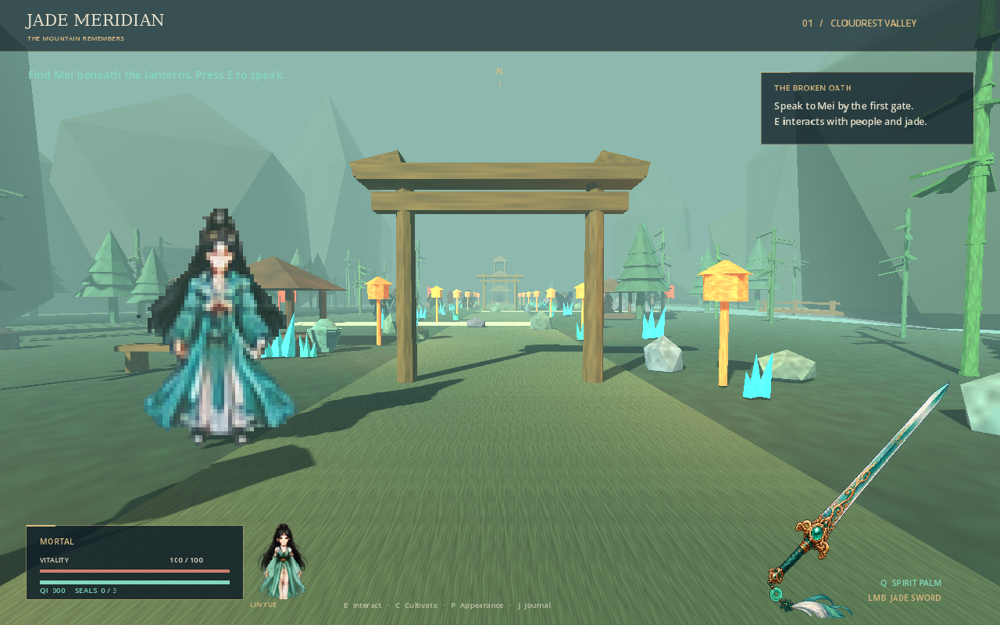
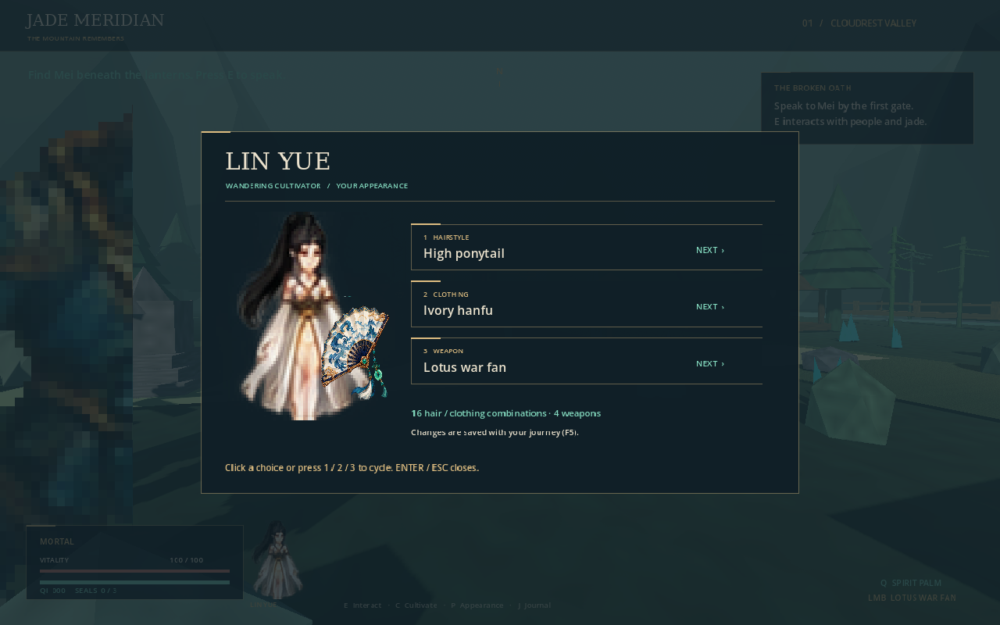
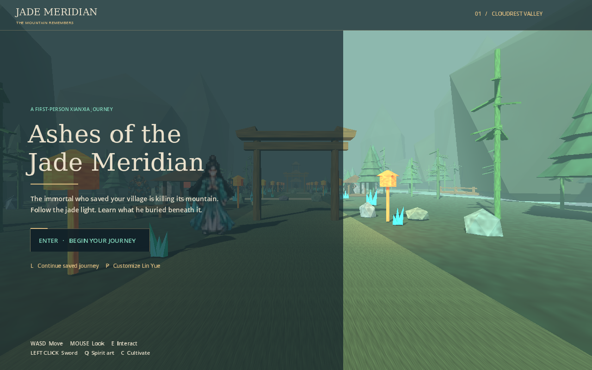
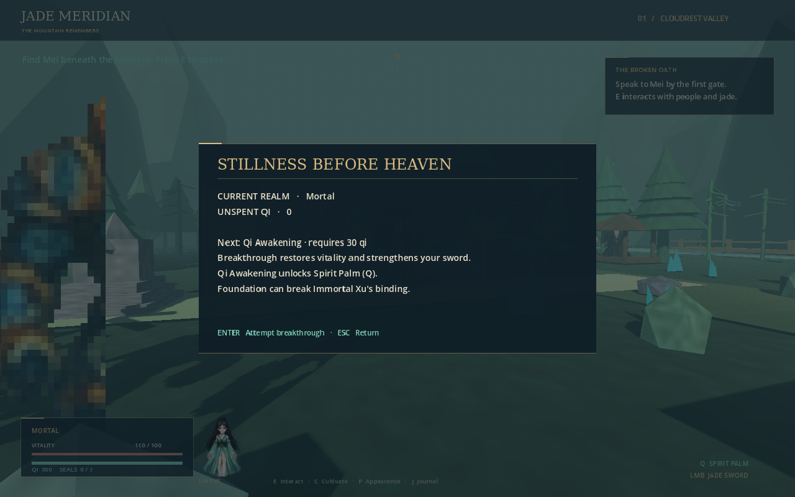

# Ashes of the Jade Meridian

A playable first-person 2.5D xianxia game built with **Godot 4.7**. Explore a misty mountain valley of textured 3D models; meet animated, billboarded 2D cultivators and spirits; gather qi, break through cultivation realms, and decide the fate of an immortal's daughter.



Immortal Xu once saved Cloudrest from the imperial hunters. When his daughter died, he bound her soul to the mountain's meridians. Now her grief poisons the valley. Mei, a healer, asks you to read the river's memory; Master Shen reveals the three seals; Lan, the bell keeper, asks whether immortality is worth another person's freedom. The final encounter offers two playable endings: **Mercy** and **Ascension**.

## Play

Open `project.godot` in Godot **4.7 stable**, import the assets, and press **F6/F5** to run the scene/project. Or, from this repository:

```bash
godot --editor --path . --import --quit
godot --path .
```

In the prepared cloud environment, first activate the installed tools:

```bash
source /workspace/.cloud-onboarding/environment.sh
```

The cloud has Godot 4.7 and checksum-verified Blender **5.2.2 LTS**. Playing interactively requires a display. Headless checks work without a GPU or display; they do not show the game.

| Control | Action |
| --- | --- |
| Enter / left click | Begin journey |
| WASD / mouse | Move / look |
| Shift / Space | Sprint / jump |
| E | Talk, gather, or restore a nearby seal in view |
| Left click | Jade sword attack |
| Q | Spirit palm after Qi Awakening; costs stamina |
| C, then Enter | Cultivation panel and breakthrough |
| H | Consume a moonlotus to heal |
| J | Story journal |
| P, then 1 / 2 / 3 | Customize hair / clothing / weapon; mouse also works |
| Escape | Pause / close panel |
| F5 / F9 | Save / load journey |
| L on title screen | Continue saved journey |
| M / V | Toggle music / voiced dialogue |
| 1 / 2 at final choice | Mercy / Ascension ending |

Bring Mei three moonlotus before spending them on healing. Absorb jade crystals along the lantern road. Breakthroughs cost **30 / 75 / 140 qi** for Qi Awakening, Foundation, and Golden Core. Wardens guard the three side altars. Xu's binding blocks attacks until all three seals are restored and you reach Foundation. Saves use Godot's `user://journey.json`; they retain collected items, defeated enemies, realms, and endings.

## Female protagonist and customization

You play **Lin Yue**, a female wandering cultivator. Press **P** on the title screen or during play to customize her. Four hairstyles (loose black hair, high ponytail, silver bob, twin buns) combine independently with four outfits (jade robes, ivory hanfu, crimson tunic, indigo robes). Her animated sprite preview and HUD portrait use a dedicated ChatGPT-generated female atlas. Four generated weapon sprites appear in the preview and first-person view.

Choose a jade sword for balanced attacks, a scarlet saber for higher damage with a slower swing, a lotus fan for faster attacks and more reach, or a meridian staff for long reach and a stronger spirit palm. Appearance and weapon choices persist with F5/F9 saves. Old saves default to the female jade-robed appearance.



## Asset library

| Library | Included assets | Origin |
| --- | ---: | --- |
| World models | **1,024 distinct GLB files** | Headless Blender 5.2.2: 16 families × 64 seeded geometry/material variants |
| World textures | **1,024 PNG files** | Original procedural grain/color textures, also embedded in each GLB |
| Sprite frames | **1,536 distinct AtlasTexture resources** | Six original ChatGPT image-generated transparent atlases, each with a 16 × 16 frame layout, plus a four-weapon atlas |
| Character rows | **96** | 80 NPC/enemy rows and 16 female protagonist appearance combinations; 16 animation frames per row |
| Sound | **13 WAV clips** | Seven original synthesized music/effect clips and six local synthetic voice clips |

The sprite count means **animation frames**, not 1,536 separately generated characters or PNGs. The six generated PNGs are preserved unchanged, and `.tres` resources reference their regions. The running world instantiates a selected subset of the full library; it does not load all 1,024 models into memory. See [asset provenance](docs/ASSETS.md) and [the architecture and story diagrams](docs/DESIGN.md).

## Validate and regenerate

```bash
python3 -m pip install -r tools/requirements.txt
bash tools/check.sh
```

The checks inspect GLB geometry, embedded textures, hashes, every sprite frame, and WAV structure; import the project; run a world smoke test; and execute **43 gameplay checks**, including the complete quest, both endings, movement, combat gates, and save/load. `tools/install_godot.sh /tmp/jade-godot` installs the official checksum-verified Linux Godot 4.7 binary if needed.

To regenerate the model library and original audio:

```bash
blender --background --factory-startup --python tools/generate_world.py
python3 tools/register_sprites.py
python3 tools/generate_audio.py --espeak espeak-ng
```

Image generation requires ChatGPT's image-generation capability; `register_sprites.py` registers the existing artwork and does not manufacture replacement art. Model generation uses seed `7301`. The optional trailing Blender argument `-- 2` generates a small sample; use the default 64 variants for the full library and asset validation. Run sample generation in a separate copy to keep the committed manifest intact.

For real engine screenshots on a Linux machine with Xvfb:

```bash
LIBGL_ALWAYS_SOFTWARE=1 xvfb-run -a godot --path . \
  --rendering-method gl_compatibility --audio-driver Dummy -- --capture
```

CI verifies assets and gameplay, then renders and uploads fresh screenshots. Committed screenshots were captured from the actual game in Godot with Mesa software rendering, not generated as mockups.




## Scope

This is a complete small valley adventure and an extensible asset library. It has one handcrafted region, three named NPCs, three wardens, roaming spirits, a final boss, and two endings. It is not a large open-world campaign. Image-generated sprite layouts can have minor pose/alignment artifacts; voices are deliberately synthetic. Characters use frontal billboard animations rather than eight-direction sprite sets. Desktop keyboard/mouse play is supported; controller, multiplayer, mobile, web exports, and localization are future work.
