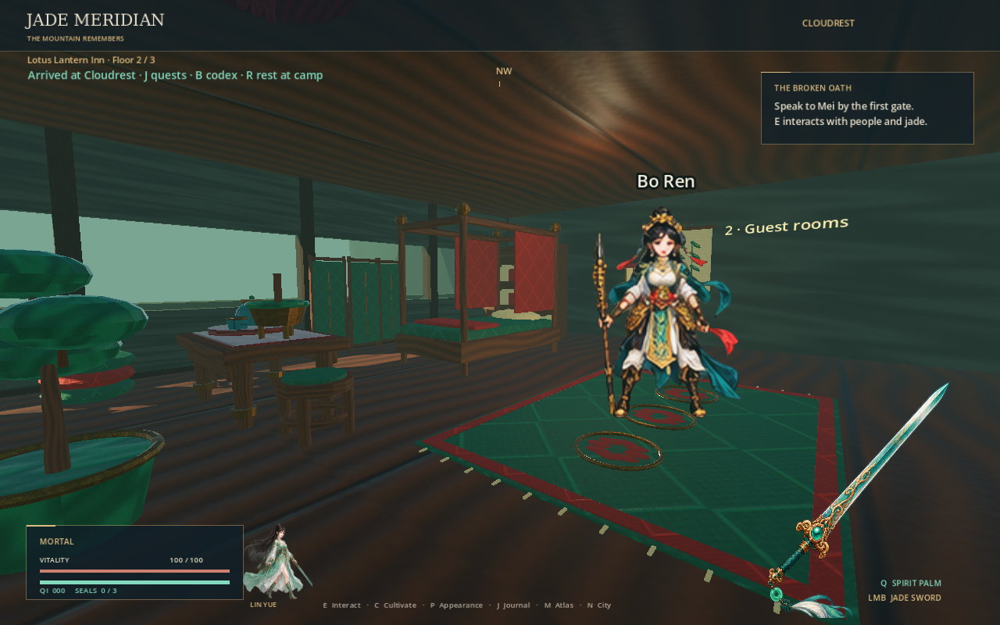
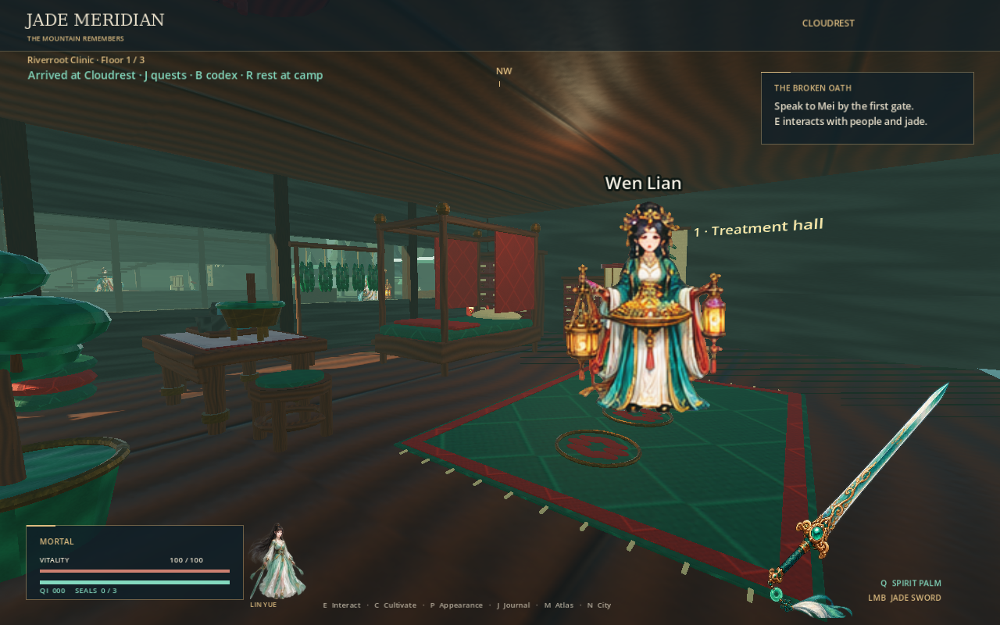
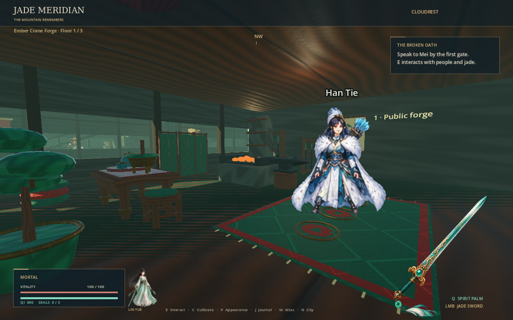
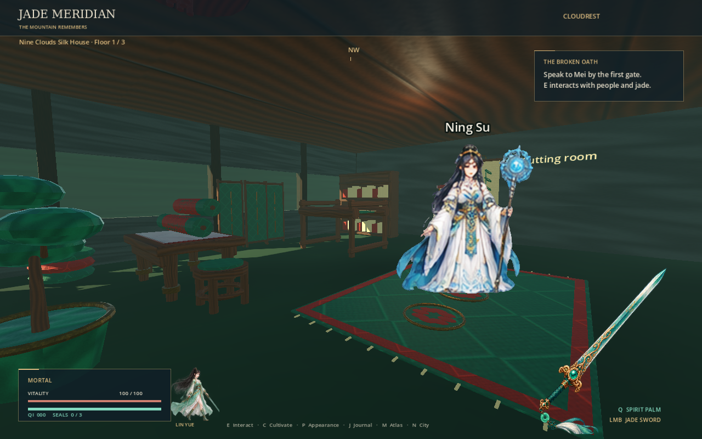
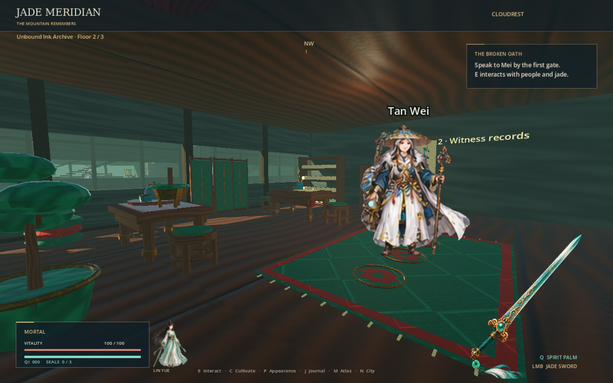
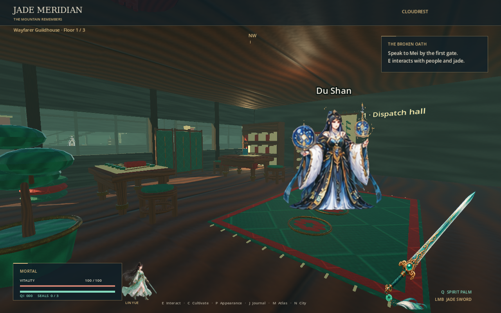
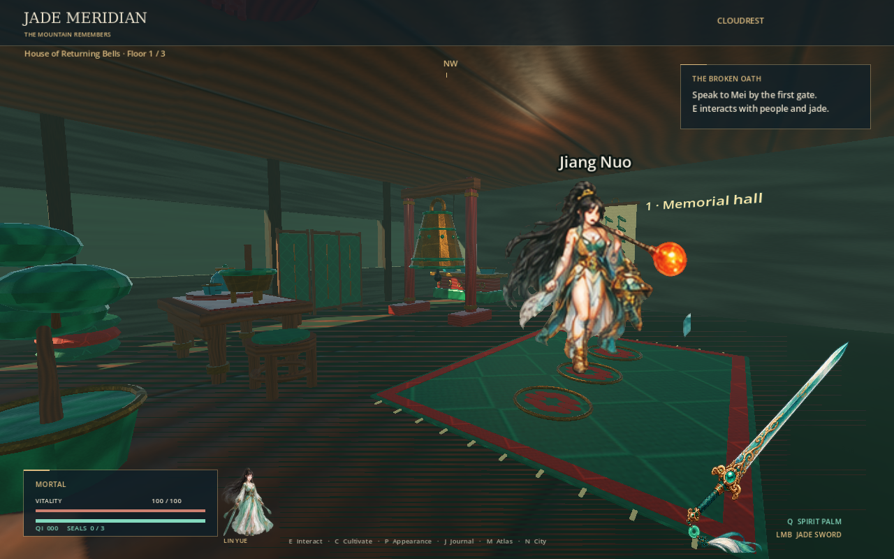
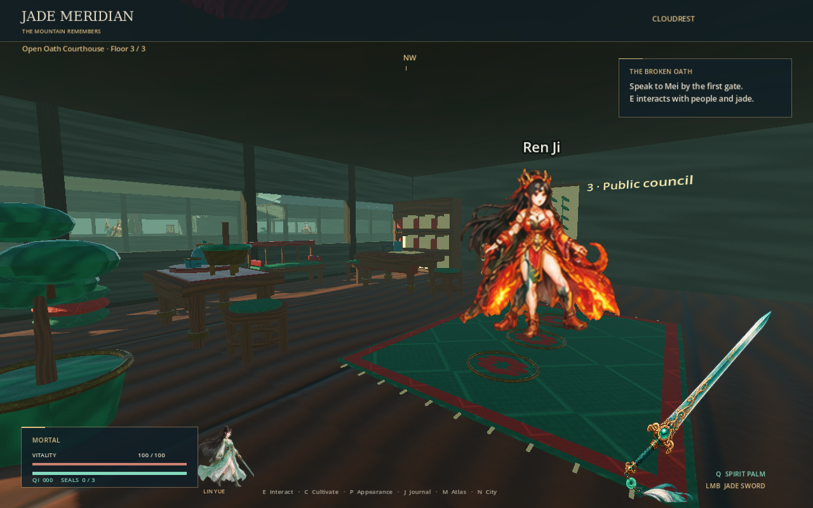

# Cloudrest city

Lantern Avenue extends south from the original valley camp. It has **12 enterable buildings, 36 furnished floors, 24 physical staircases, and 40 named residents**. The city is available in Cloudrest (`region_00`). Travel through the existing atlas returns to the valley camp, where the city gate is open.

Press **N** for the searchable directory. Search by building, district, resident, occupation, or floor name. Mark an entrance to display a gold sign and its distance in the world. Mark the same address again to clear it. Every entrance faces the cross lane on the south side of its building. The right-hand staircase connects all three floors.


| Building | Ground floor | Second floor | Third floor |
| --- | --- | --- | --- |
| Lotus Lantern Inn | Welcome hall | Guest rooms | Travelers' study |
| Riverroot Clinic | Treatment hall | Herbal dispensary | River laboratory |
| Listening Rain Teahouse | Tea room | Poetry salon | Quiet meditation room |
| Ember Crane Forge | Public forge | Weapon workshop | Cultivators' practice room |
| Nine Clouds Silk House | Cutting room | Pattern loft | Fitting room |
| Unbound Ink Archive | Public reading room | Witness records | Unsealed collection |
| Jade Brush Talisman Hall | Brush workshop | Apprentices' classroom | Ward research room |
| Wayfarer Guildhouse | Dispatch hall | Caravan office | Route council |
| Falling Star Observatory | Instrument gallery | Star chart room | Meridian study |
| Moonwell Bathhouse | Public baths | Steam room | Healing retreat |
| House of Returning Bells | Memorial hall | Resonance workshop | Bellkeepers' sanctuary |
| Open Oath Courthouse | Petition hall | Mediation room | Public council |

A resident occupies every floor. Gate guide Tao Jun, market gardener Min Qiu, ferry courier Rao Wen, and storyteller Deng Yi live along the avenue. All 40 residents have personal dialogue and a second interaction: advice, healing, rest, tea, appearance choices, cultivation, chapter reading, regional travel, or the city directory. Press **E**, then **1** or **2**. Enter or Escape closes the conversation.

Their short personal accounts are authored in `content/city/cloudrest.json`. City residents reuse 40 distinct existing high-resolution NPC sprite designs with four animated poses each. The expansion adds no new source character artwork or generated animation frames. The campaign's 100 authors and 1,200 chapter chains remain separately available. City rest restores vitality and stamina; it does not advance an objective requiring rest at the valley camp or generate qi rewards.





The district's architecture is assembled from timber, plaster, framed windows, raised eaves, lanterns, and shop banners using Godot geometry. Its interiors now use **40 original GLBs generated with headless Blender 4.3.2**, placed **653 times across all 36 floors**. Each floor contains at least **16 models**. The room layouts are authored in `content/city/interiors.json`; `scripts/interiors.gd` caches each imported scene and uses the manifest's model bounds for furniture collision. Meshes are joined by material in Blender and culled at distance in Godot. The city retains a regular street plan, and residents stay at their addresses rather than following daily schedules.

| Library batch | Distinct GLBs | Furnishings |
| --- | ---: | --- |
| Common | 8 | Carved tables and stools, canopy bed, bookcase, chest, floor lantern, flower vase, folding screen |
| Craft | 16 | Tea set, medicine drawers and tray, forge hearth, anvil, weapon rack, loom, silk rolls, scroll rack, writing desk, ink set, talisman board, incense burner, astrolabe, orrery, star chart |
| Special | 16 | Bath basin, towel rack, bell, offering altar, court bench, petition box, guild map table, supply crates, hanging lantern, bamboo scroll, patterned rug, cushions, bonsai, crystal array, drum, drying herbs |

Twelve material families use **36 generated 256×256 texture maps**: albedo, roughness, and tangent-space normal maps for walnut, lacquer, jade, brass, ceramic, silk, brocade, parchment, stone, iron, water, and embers. Wood grain, textile weave, ceramic bands, metal engraving, and stone veins provide actual pixel detail. Each GLB embeds its textures, including glTF's packed metallic/roughness map. Floors, ceilings, and plaster also use the source PBR maps. The source PNGs and hash manifest are committed; Godot's extracted copies are ignored.










Generate the assets in restartable batches and verify them with:

```bash
blender --background --factory-startup --python tools/generate_interiors.py -- --batch common
blender --background --factory-startup --python tools/generate_interiors.py -- --batch craft
blender --background --factory-startup --python tools/generate_interiors.py -- --batch special
python3 tools/validate_interiors.py --expect-count 40
```

The validator checks hashes, distinct GLBs, geometry, UVs, embedded PNGs, all three PBR channels, source-map detail, complete floor coverage, use of every model, room boundaries, ceiling clearance, and open approaches to residents and stairs. See [asset provenance](ASSETS.md) for the source and tool versions.

Stairs use visible wooden treads over continuous ramp colliders so the existing first-person controller can climb without jumping. Upper floor slabs leave the stairwell open. Doors, furniture, glass, walls, and floors have physical collisions. Sight and proximity checks prevent interactions through walls or between floors. Dialogue uses the existing pause behavior.

Save version four allows positions throughout the Cloudrest city, including its upper rooms, and retains version-three regional resource and monster consumption. Versions one through three still migrate. Coordinates outside the world, or city coordinates belonging to another region, are rejected before any journey state changes. Travel disables city geometry and resident collisions and closes the southern gate; returning restores access. Loading and rest retain exactly one instance of each city resident.

`tests/city.gd` performs **526 checks** in the actual engine. It verifies all 40 models' imported albedo, roughness, and normal maps and every floor's prop count, walks through all twelve doors, climbs and descends both staircases in every building, exits onto the street, talks to all 40 residents, selects their stories and services, verifies walls and floors block sight, searches and marks addresses, restores an upper-floor save, migrates a version-three save, and checks regional travel and camp rest. It runs in `tools/check.sh`, alongside the existing campaign, combat, ending, save, and packaged-world suites. The packaged smoke test requires all 40 GLB scenes and at least 576 prop placements to load.

The standard `--capture` mode also renders city evidence in CI. For city screenshots alone:

```bash
LIBGL_ALWAYS_SOFTWARE=1 xvfb-run -a godot --path . \
  --rendering-method gl_compatibility --audio-driver Dummy -- --capture-city
```

The earlier bulk animation request remains incomplete as documented in [REVISION.md](REVISION.md); this city expansion does not change that outstanding scope.
