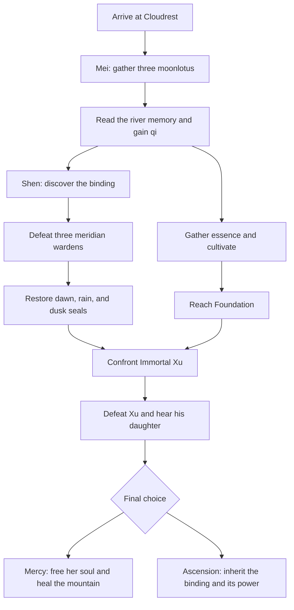
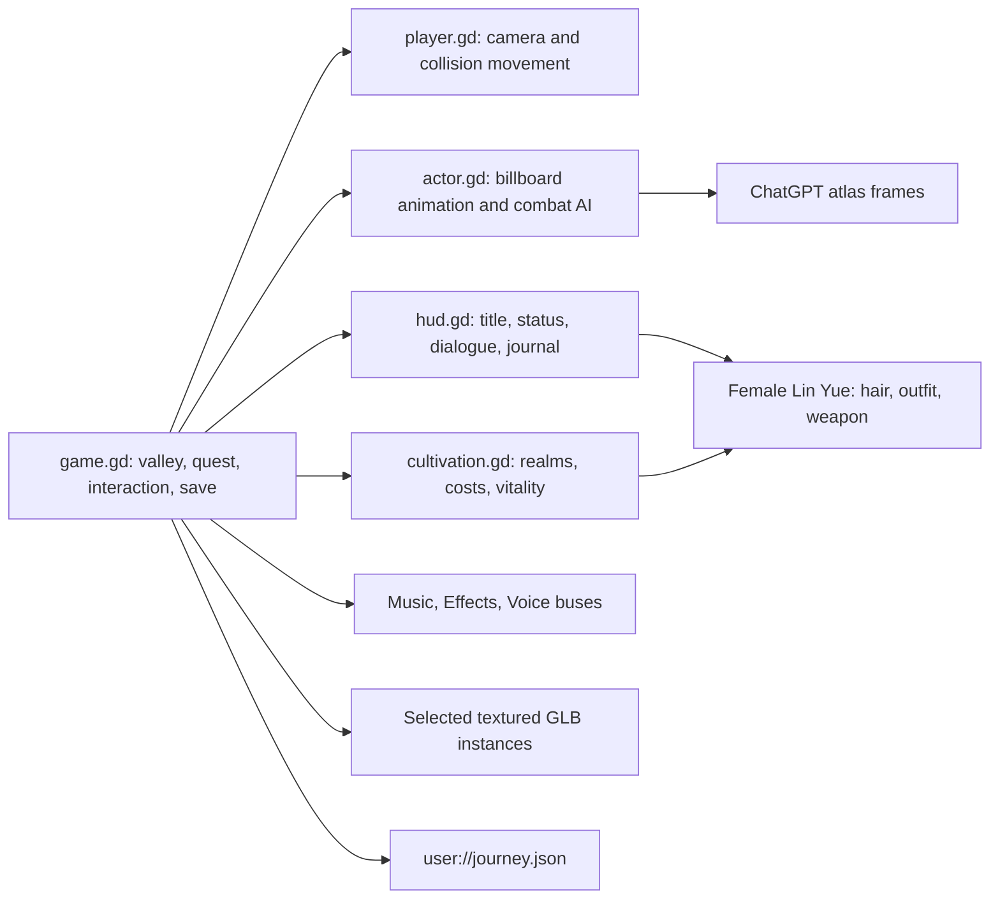
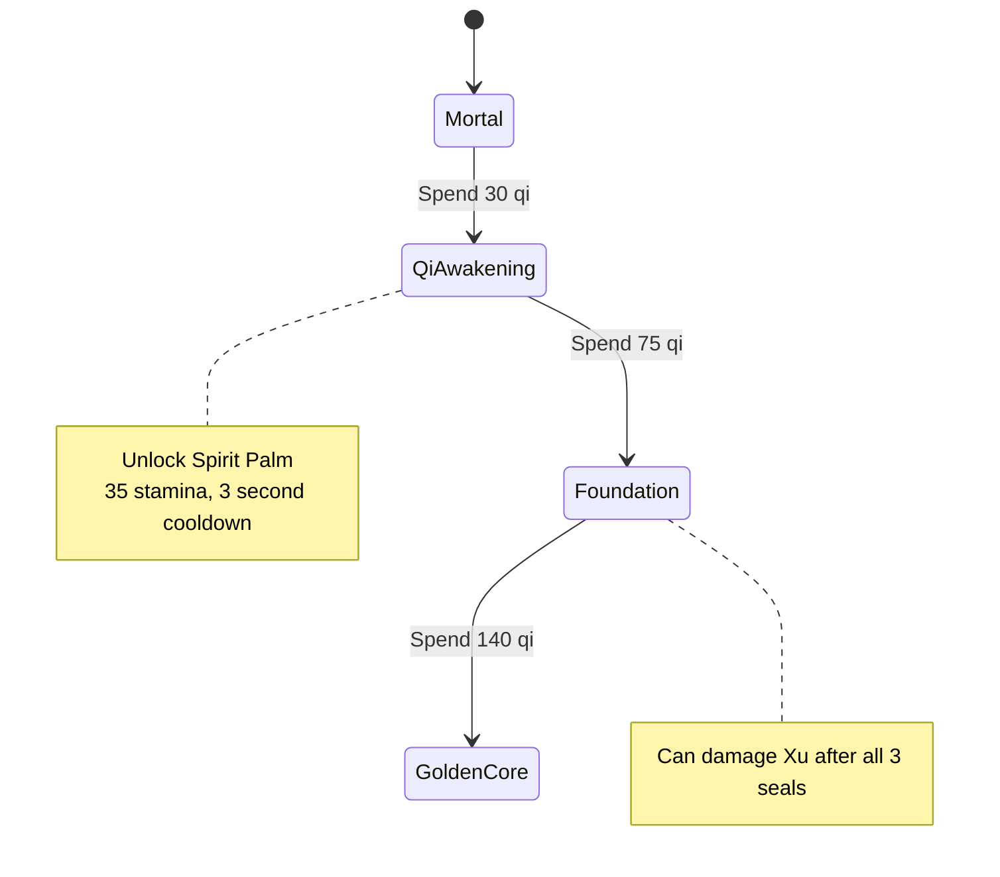
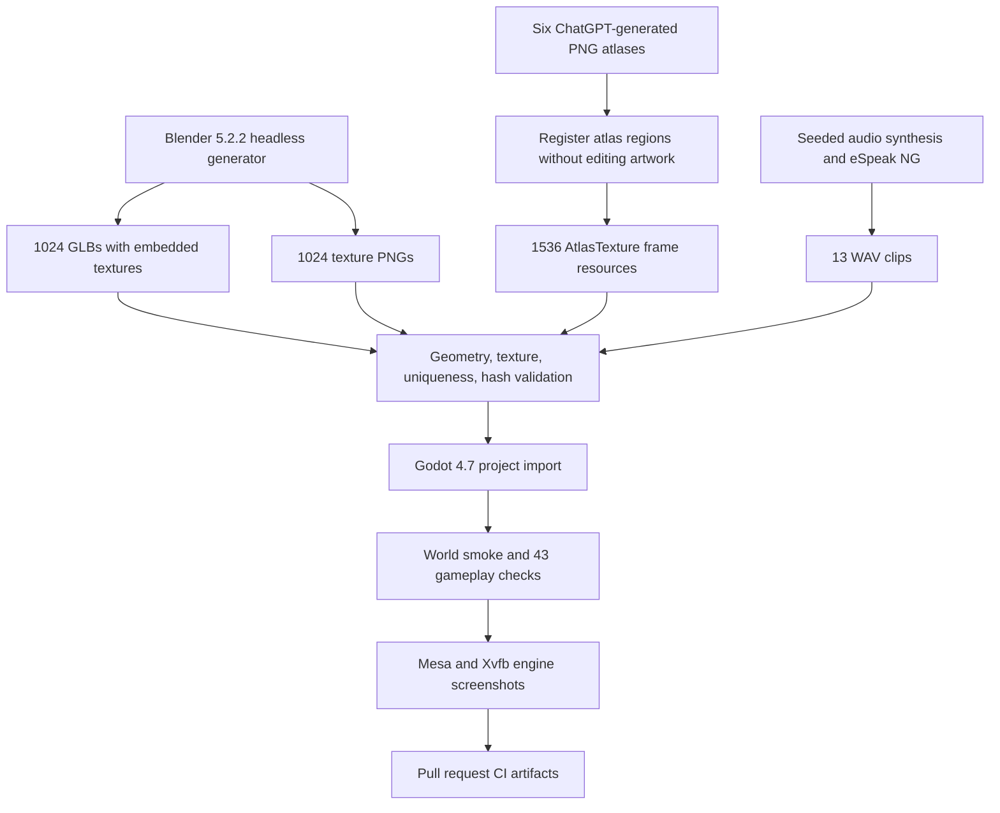

# Game and story design

The game asks whether cultivation means becoming powerful enough to keep someone, or wise enough to let them go. Xu is a protector whose refusal to grieve has become the valley's curse. Each NPC offers a different interpretation of his oath. The player's final act determines whether the mountain gains a spring or another immortal keeper.

## Quest flow

The boss checks both requirements on every sword/spirit attack, so entering the final arena early cannot bypass progression. Seals check their own guardian's defeat. Finite essence, herb, seal, and enemy rewards provide enough qi to reach Golden Core. Repeated interactions cannot duplicate collected rewards. Falling or defeat returns the player to Mei with a 15-qi penalty; unlocked realms remain.

## Runtime architecture

Headless runs load and validate audio resources but skip playback because there is no audible output; graphical runs play the Music, Effects, and Voice buses.

Actor animations select four frames for each state at six frames/second. Enemies approach within their awareness radius, attack with a cooldown, flash when hit, and dissolve when defeated. Sprite3D billboarding preserves the 2D presentation as the first-person camera turns. GLB caches share imported resources across repeated props; distant mountains use scaled textured rock variants. Compatibility rendering keeps the game usable on software OpenGL.

## Female protagonist customization

Lin Yue is female by default. Hair and clothing are independent indices mapping to `hair * 4 + clothing` in a dedicated 16-row generated atlas. Weapons select a separate generated sprite, an attack reach/cooldown, and a damage multiplier. P opens the appearance panel on the title screen or during play; click a choice or use 1/2/3. Save data contains three separate appearance indices and defaults older saves to the female jade-robed sword wielder. Gameplay checks verify independence, row mapping, cycling, changed weapon stats, and persistence.

## Cultivation

Every breakthrough adds 30 maximum vitality and 14 sword damage, and restores vitality. Stamina regenerates while not sprinting; spirit art and sprinting share that resource. Herbs offer a separate healing choice. The final choice is retained in the save and the player can return to explore afterward.

## Asset and validation pipeline

## Known limits

The valley is small and handcrafted. Enemy steering is direct planar pursuit, not obstacle-aware navigation. The terrain, gates, and valley bounds have collision; many decorative GLB props are visual scenery. Generated atlas cells sometimes contain pose or alignment artifacts; every registered frame is nonempty and distinct, but that check does not judge animation quality. Voices use local synthetic speech rather than acted performances. Saves are versioned locally; there is no cloud-save service.
