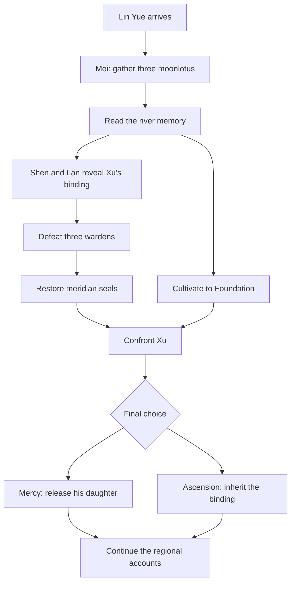
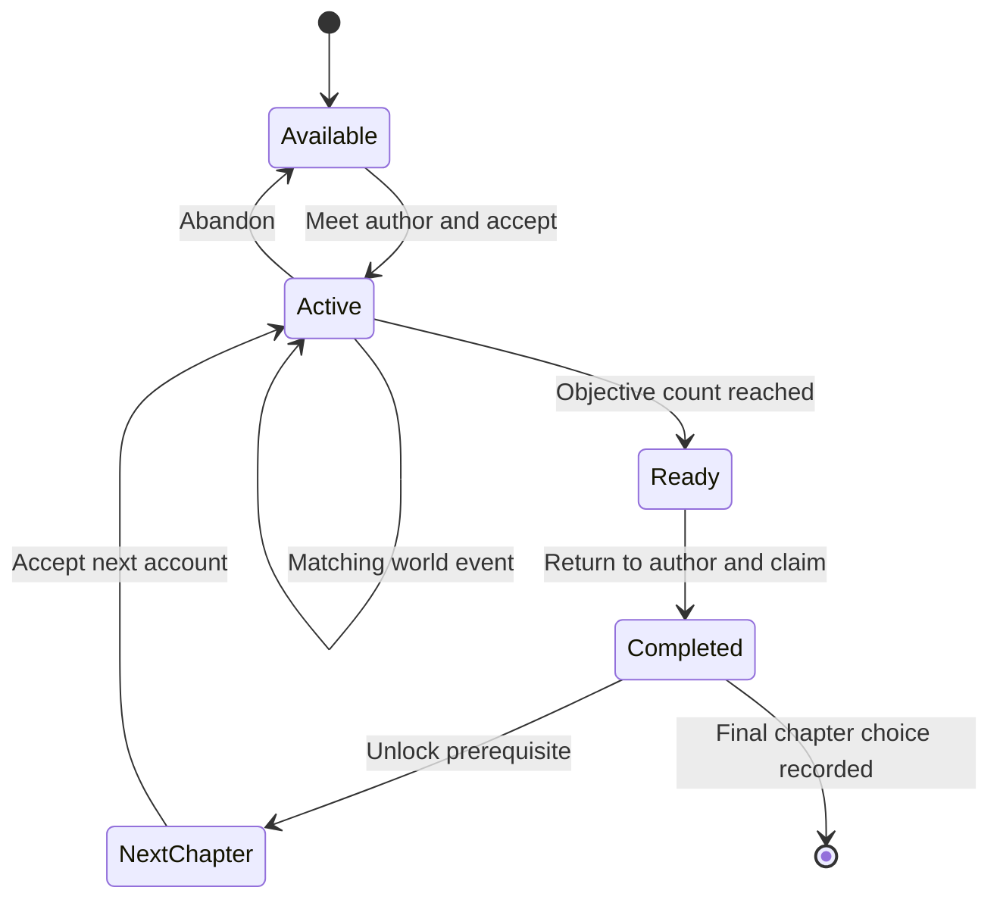
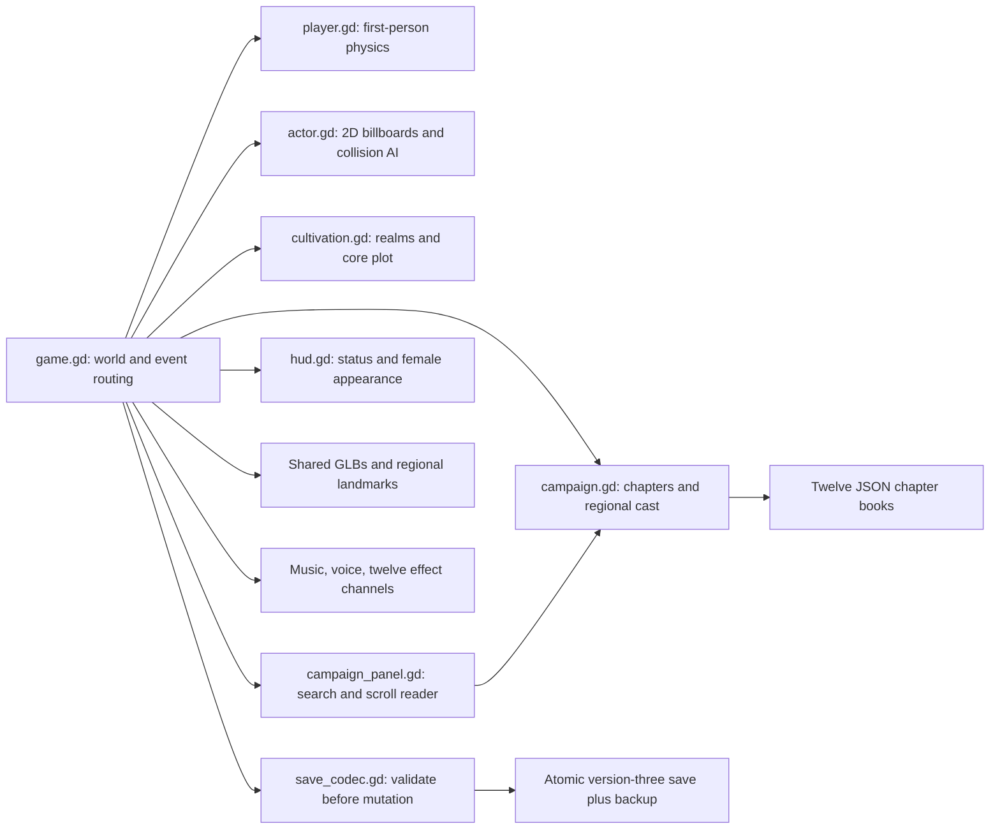
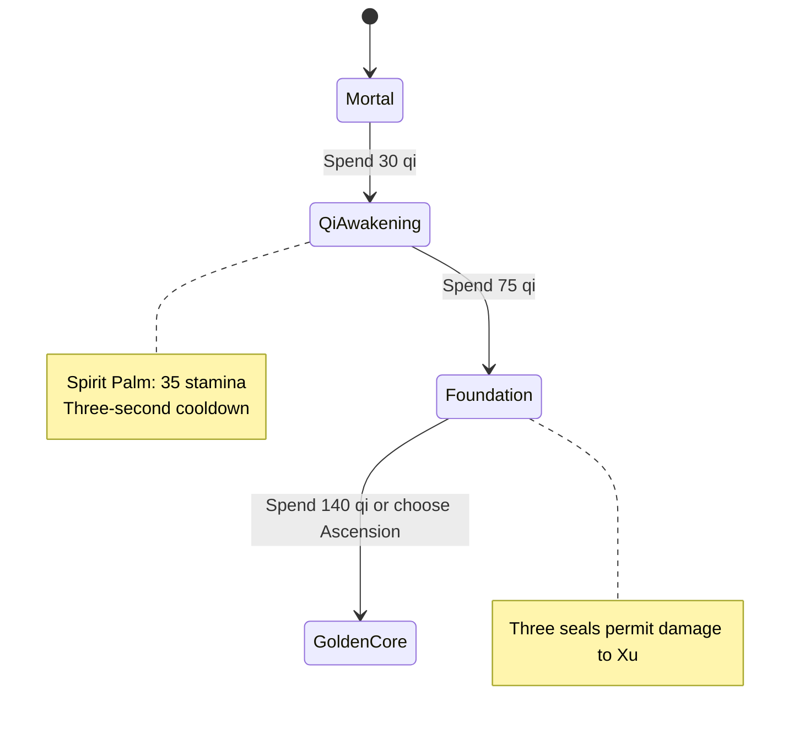
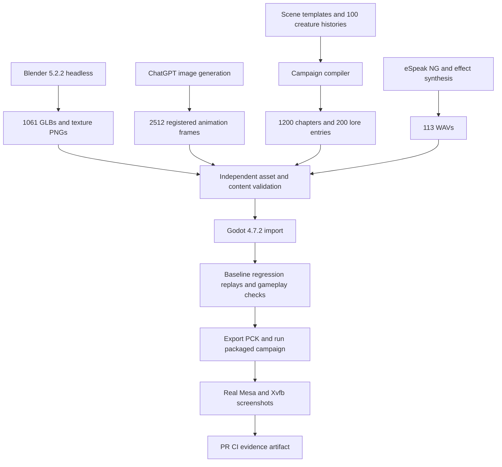

# Game and story design

Cultivation asks what a person becomes responsible for when she gains power. Xu's wish to keep his daughter becomes a mountain's prison. Lin Yue may release her or inherit the binding. The regional campaign examines the same question through a hundred witnesses and the records their institutions tried to erase.

## Central plot

## Regional quest lifecycle

Each of the hundred NPCs has twelve chapters. Up to six are active. Rewards require the author; event targets must match. Rest renews regional resources and monsters, while permanent core progress persists. Unfinished chapters show the briefing. Completed chapters reveal the aftermath and chosen consequence. Regional pages use lazy loading, keeping two books cached. See [campaign construction and measurement](CAMPAIGN.md) for procedural-content limitations.

## Runtime and persistence

Actors combine Sprite3D billboards with CharacterBody3D collision. Core actors use sixteen-frame animations; the Lin Ning pilot uses sixteen doubled-resolution poses at 12 FPS, while other campaign characters use four generated poses with visible alternation, windup, hurt flash, and death fade. Ranged attacks require sight, charge creatures telegraph a rush, leech creatures regain vitality on a successful hit, and melee creatures approach physically. Local steering slides around obstacles; full navigation meshes are outside this prototype.

Pause freezes gravity, movement, enemy updates, and combat timers. Focus loss opens a pause panel. Player attacks and interactions require unobstructed sight through the world collision layer. Respawn resets motion, aim, and pursuers. World models are cached and reused. The compatibility renderer supports Mesa software OpenGL.

## Cultivation and female appearance

Breakthroughs restore health, add thirty maximum vitality, and increase weapon damage. Sprinting and spirit palm share stamina. Lin Yue has independent hair, clothing, and weapon indices. Four hairstyles × four outfits map to sixteen generated appearances; four first-person weapons change combat stats. Appearance, stamina, orientation, core progress, campaign progress, region, and current-region consumption persist in validated saves. Version-one and version-two saves migrate.

## Asset and CI pipeline

[The audit ledger](audit/README.md) separates failure cases from underlying defect families. CI completes all quest chains and checks both endings, actual regional interactions, persistence, and packaged content. Committed screenshots come from the running engine. See [the current revision and its remaining bulk asset work](REVISION.md).
