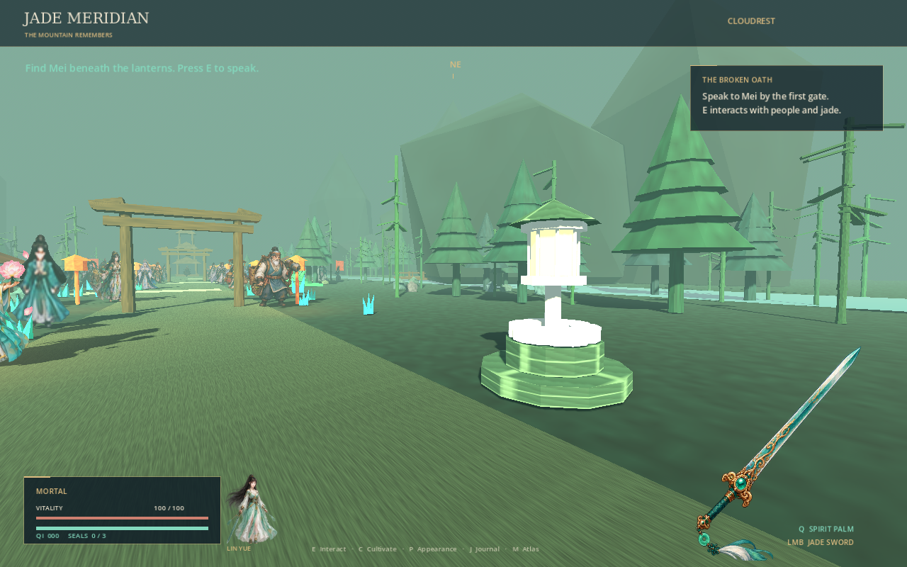
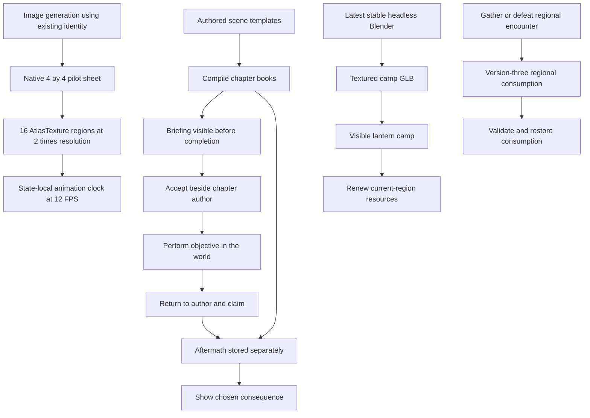

# Chapter chronology, regional saves, and animation pilot

The chapter reader previously showed each chapter's successful return while its objective was still unfinished. The baseline at `7ead856` reproduced this in **1,200 of 1,200 chapter cases**. All share one underlying briefing/aftermath defect. This is not evidence of 1,200 independent bugs.

Briefings and aftermath now occupy separate fields. The reader reveals aftermath and the selected consequence only after a chapter is claimed. The 100 final chapters no longer announce a nonexistent next chapter. Existing prose remains available after completion.

Other changes address charging outside the initiation range, charge contact damage and gravity, cancelled windups, pending attacks after respawn, animations starting midway through their attack, breakthroughs incorrectly satisfying camp-rest objectives, and Ascension failing to grant its narrated Golden Core.

Version-three saves preserve consumed current-region blossoms and defeated regional monsters. Loading a save does not replenish them. Rest and travel renew them. Version-one and version-two saves remain readable; missing regional history receives deterministic empty defaults. Old Ascension saves migrate to Golden Core. Invalid regional IDs are rejected before changing the current journey.

## Assets and remaining request

| Item | Delivered in this revision | Remaining |
| --- | --- | --- |
| Latest stable tools verified on 2026-10-02 | Godot 4.7.2; Blender 5.2.2 LTS, official checksums | None for the CI environment |
| Double existing frame resolution | Lin Ning: 154.75 to 309.5 pixels in each dimension | Other characters, original sheets, heroine, and weapons |
| 10,000 additional animation frames | 16 distinct generated poses for existing NPC `npc_000` | **9,984** |
| Headless Blender model | One textured, embedded-texture camp beacon used in all regions | Further models only when needed |

The initial whole-atlas edit requested 2,508×2,508 and returned 1,254×1,254. That edit failed the resolution requirement and is not substituted into the live library. The successful pilot uses a new 4×4 layout in a native 1,254×1,254 sheet, with two-pixel margins. Its registered 309.5×309.5 regions are exactly twice the previous 154.75×154.75 regions. Source pixels are untouched; registration only creates AtlasTexture resources. Four frames each cover idle, walk, attack, and death. Lin Ning plays the living animation at 12 FPS.

This improves available animation detail for the pilot. It is not a measured increase in rendering FPS. The remaining request is recorded in `assets/sprites/animation/request.json`; pending frames are not counted as generated assets.

## Flow

## Verification

`bash tools/check.sh` validates all existing assets, the new frame hashes and mappings, the camp GLB, campaign links and word counts, and both packaged and running game smoke tests. It replays the same 1,200 chapter chronology cases and exercises the actual reader before and after each claim. Gameplay regressions cover charge behavior, walls, pause, save restoration and migration, camp rest, and Ascension.

`docs/audit/chapter-state-baseline.json` preserves the baseline observations. `chapter-state-results.json` and `chapter-state-ledger.csv` record current observations per chapter. CI also regenerates the source-derived campaign and sprite registrations and checks they match the committed files.

The bulk asset request remains incomplete, so the PR is a draft. It does not claim completion of 10,000 generated frames or doubling the full existing sprite library.
